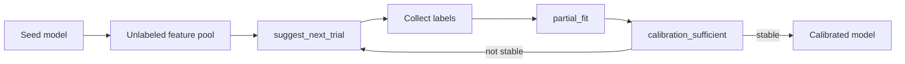

# Active Learning

Use active learning to collect labels for the trials that are most likely to improve your BCI model. The Python SDK exposes stateless helpers for pool-based calibration, streaming label requests, and label-free stopping.

<Info>
Active learning operates on **preprocessed feature rows**, not raw EEG. Use arrays shaped `(n_trials, n_features)` for pools and `(n_features,)` or `(1, n_features)` for single streaming trials.
</Info>

## Core Workflow

Start with a small seed calibration set, rank an unlabeled feature pool, collect labels for the most informative trials, update with `partial_fit()`, and stop when the posterior stops changing.



```python
from nimbus_bci import NimbusLDA
from nimbus_bci.active_learning import calibration_sufficient, suggest_next_trial

clf = NimbusLDA().fit(X_seed, y_seed)
previous = clf.get_model()

for _ in range(max_rounds):
    ranked = suggest_next_trial(
        clf,
        X_pool,
        strategy="bald",
        n=4,
        num_posterior_samples=256,
        rng_seed=0,
    )

    X_new, y_new = collect_labels_for(ranked.indices)
    clf.partial_fit(X_new, y_new)

    status = calibration_sufficient(
        clf,
        X_pool,
        criterion="posterior_stability",
        previous=previous,
        threshold=0.02,
    )
    if status.is_sufficient:
        break

    previous = clf.get_model()
```

## Pool-Based Trial Ranking

Use `suggest_next_trial()` when you have an unlabeled pool of candidate feature rows and want the top `n` trials to label next.

```python
from nimbus_bci.active_learning import suggest_next_trial

result = suggest_next_trial(
    clf,
    X_pool,
    strategy="bald",          # or "entropy", "margin", "least_confidence"
    n=4,
    num_posterior_samples=256,
    rng_seed=0,
)

print(result.indices)  # top pool indices, most informative first
print(result.scores)   # one informativeness score per row in X_pool
```

`suggest_next_trial()` accepts either a fitted Nimbus classifier (`NimbusLDA`, `NimbusQDA`, `NimbusSoftmax`, `NimbusSTS`) or a raw `NimbusModel` snapshot. It returns a `QueryResult` dataclass with:

- `indices`: top-`n` indices into `X_pool`.
- `scores`: raw informativeness score for every row in `X_pool`.
- `strategy`: the strategy used.
- `n_posterior_samples`: posterior samples used for the score (`1` for cheap strategies).

<Note>
`strategy="bald"` is supported for `NimbusLDA`, `NimbusQDA`, and `NimbusSoftmax`. It is not supported for `NimbusSTS` in this release because STS posterior sampling needs temporal-coupling support.
</Note>

## Streaming Query Gate

Use `should_query()` when a single trial arrives during a live session and you need to decide whether asking for a label is worth the calibration cost.

```python
from nimbus_bci.active_learning import should_query

decision = should_query(
    clf,
    x_new,
    strategy="entropy",
    threshold=1.0,
)

if decision.should_query:
    request_label(x_new)
```

The result is a `StreamingQueryDecision` dataclass with:

- `should_query`: whether the score crossed the threshold.
- `score`: raw informativeness score.
- `threshold`: threshold used for the decision.
- `strategy`: strategy used.

<Warning>
`should_query()` intentionally supports only cheap strategies: `entropy`, `margin`, and `least_confidence`. Single-point BALD is too noisy; batch streaming trials and call `suggest_next_trial(strategy="bald")` if you need sample-based ranking.
</Warning>

## Stopping Calibration

Use `calibration_sufficient()` to stop collecting labels once additional cues are unlikely to change predictions over the pool.

```python
from nimbus_bci.active_learning import calibration_sufficient

status = calibration_sufficient(
    clf,
    X_pool,
    criterion="posterior_stability",
    previous=previous_model_snapshot,
    threshold=0.02,
)

if status.is_sufficient:
    print("Calibration can stop")
```

`calibration_sufficient()` returns a `CalibrationStatus` dataclass with:

- `is_sufficient`: `True` when the criterion signal is below the threshold.
- `signal`: mean total variation for `posterior_stability`, or mean BALD for `expected_info_gain`.
- `threshold`: threshold used for the comparison.
- `criterion`: criterion used.
- `details`: extra diagnostic values such as max/min TV or BALD.

### Stopping Criteria

`posterior_stability` compares two consecutive model snapshots over the same `X_pool`. It measures the mean total-variation distance between `predict_proba` outputs and works for every Nimbus head, including `NimbusSTS`.

```python
status = calibration_sufficient(
    clf,
    X_pool,
    criterion="posterior_stability",
    previous=previous,
    threshold=0.02,
)
```

`expected_info_gain` measures mean BALD over the current pool. It does not use `previous`, and it is available for `NimbusLDA`, `NimbusQDA`, and `NimbusSoftmax`.

```python
status = calibration_sufficient(
    clf,
    X_pool,
    criterion="expected_info_gain",
    threshold=0.05,
    num_posterior_samples=256,
)
```

<Tip>
For conservative calibration, use `posterior_stability` as the primary stopping criterion and treat `expected_info_gain` as a supporting signal. Early models can be confidently wrong and may underestimate expected information gain.
</Tip>

## Strategy Guide

| Strategy | Query direction | Units | Works with STS? | Best use |
| --- | --- | --- | --- | --- |
| `entropy` | Higher is more informative | Bits, `[0, log2(n_classes)]` | Yes | Fast default for uncertain predictions |
| `margin` | Lower is more informative | Probability gap, `[0, 1]` | Yes | Top-1 vs top-2 ambiguity |
| `least_confidence` | Higher is more informative | `1 - max(p)` | Yes | Simple max-confidence thresholding |
| `bald` | Higher is more informative | Bits, `[0, log2(n_classes)]` | No | Epistemic uncertainty from posterior samples |

## Practical Defaults

- Start with `strategy="bald"` for pool-based calibration when using `NimbusLDA`, `NimbusQDA`, or `NimbusSoftmax`.
- Use `num_posterior_samples=256` for BALD ranking stability. Lower values can be faster but noisier.
- Use `strategy="entropy"` for streaming `should_query()` gates.
- Use `criterion="posterior_stability"` for label-free stopping, with a threshold near `0.02` as an initial tuning point.
- Keep `X_pool` fixed across a calibration round so scores and stability checks are comparable.

## Next Read

<CardGroup cols={2}>
  <Card title="Python API Reference" icon="book" href="/python-sdk/api-reference">
    Function signatures and dataclass fields for active learning.
  </Card>
  <Card title="Streaming Inference" icon="activity" href="/python-sdk/streaming-inference">
    Combine real-time prediction with query gates and feedback.
  </Card>
  <Card title="sklearn Integration" icon="code" href="/python-sdk/sklearn-integration">
    Use Nimbus classifiers inside sklearn workflows.
  </Card>
  <Card title="Model Selection" icon="brain" href="/model-specification">
    Choose the right Bayesian head before calibration.
  </Card>
</CardGroup>
